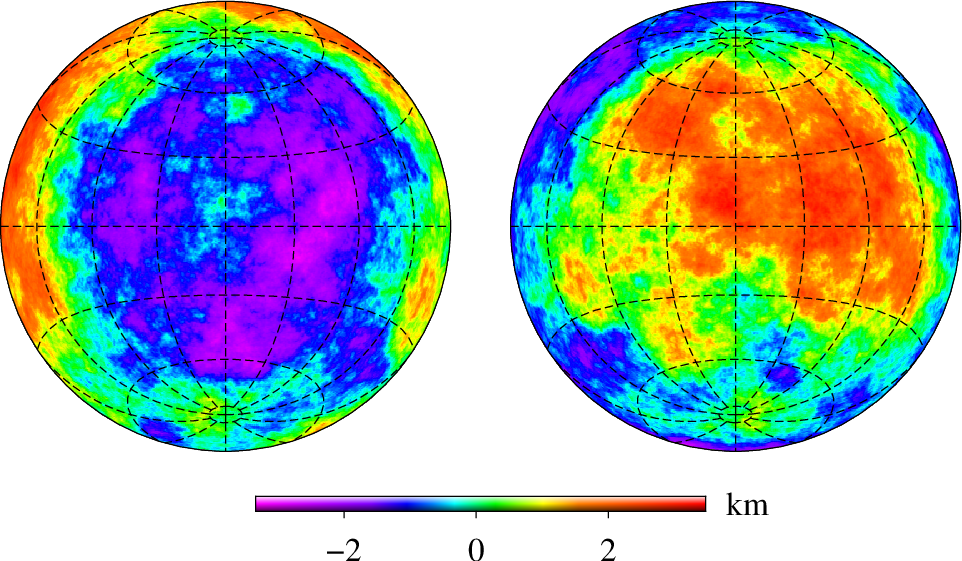

# gmtsph-JA: Global grid data mapping using GMT5 with azimuthal equidistant projection.

## Installation

**gmtsph-JA** is a shell script that plots global grid data using [GMT5](https://gmt.soest.hawaii.edu) with azimuthal equidistant projection. The propose of this script is to enable a quick look of a .nc or .grid file, and hopefully ease our every work a little bit. For specified needs, a proper script is still needed. To use it, simply copy the shell scripts *dispOption.sh* and *gmtsph-JA.sh* into any directory that is included in your $PATH, then reopen the terminal.

## Setup

Please go to the end of *gmtsph-JA.sh*, where you will see lines as
```bash
imgcat $jpgfile #open the output file in terminal, this requires the iTerm.app and imgcat.sh
open $jpgfile #'open' is a command in-build within MacOS
```
Please use either of them as you see fit. Or for Ubuntu users, you may want to use the command `see`. I don't know the corresponding command for other Linux distributions. But you see the gist here.

## Usage

```bash
gmtsph-JA -i<grid-data> [-r<xmin>/<xmax>/<ymin>/<ymax>] [-l<clon>/<clat>/<horizon>] [-u<unit>] [-c<cpt-file>] [-a<x-label>,<y-label>] [-v<c-tick>] [-g] [-s] [-G<grad-data>] [-p<polygon-file>]
```

## Options

The only argument you need to input is name of the grid file to get a glance of the file. To get a better look, the following options need to be set.

+ __-i__: Name of the input grid file. Perfectly, you should use a .nc file. However, [Surfer](https://www.goldensoftware.com/products/surfer)'s griding format is also supported since the GMT5. Note that the data range should across the whole globe.
+ __-r__: Data range of the input grid file. The script will use the whole data range by default. The use of this option will force a customized range for plotting.
+ __-l__: Set the center of the projection and degrees that shown on the figure.
+ __-u__: Unit of the input data. A special case is that if you want to annotate the color bar with 'km' while the unit of the input data is in meter. Then please set the argument of this option as 'km+Uk' to turn on the feature.
+ __-c__: input cpt file used for generating a data specified cpt file. The GMT command 'grd2cpt' is used by default. To use the input cpt file directly, you need to disable the use of 'grd2cpt' by using the __-n__ option.
+ __-a__: Axis's labels separated by commas.
+ __-v__: Set interval of the color bar's labels manually.
+ __-g__: Draw an extra layer of shaded topography to get a 3D texture of the output image. The default will be the input grid data.
+ __-G__: Use another grid file to draw the shaded topography. Please note that the range of the file should be equal or larger than the data grid.
+ __-s__: Plot the day-night terminator.
+ __-p__: Read and plot polygonal boundaries.

## Example

The following is used to draw the `example.nc`. Names of the output files are taken from the input grid file. Moreover, the script will output a png (no background) and a eps file.

```bash
gmtsph-JA -i exmaple.nc
```

The output should be as below.


